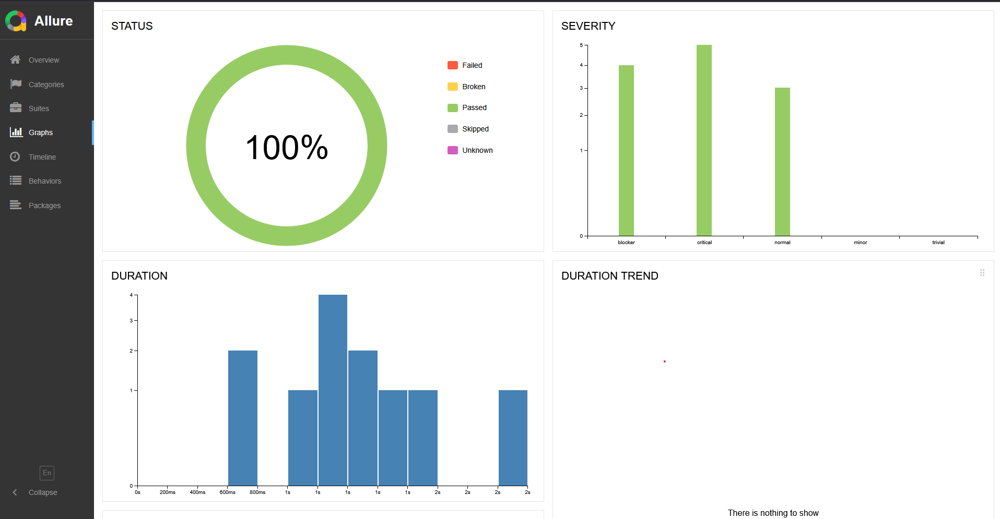
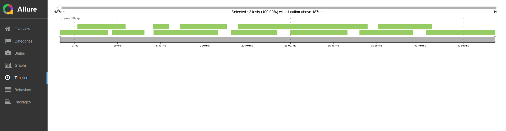
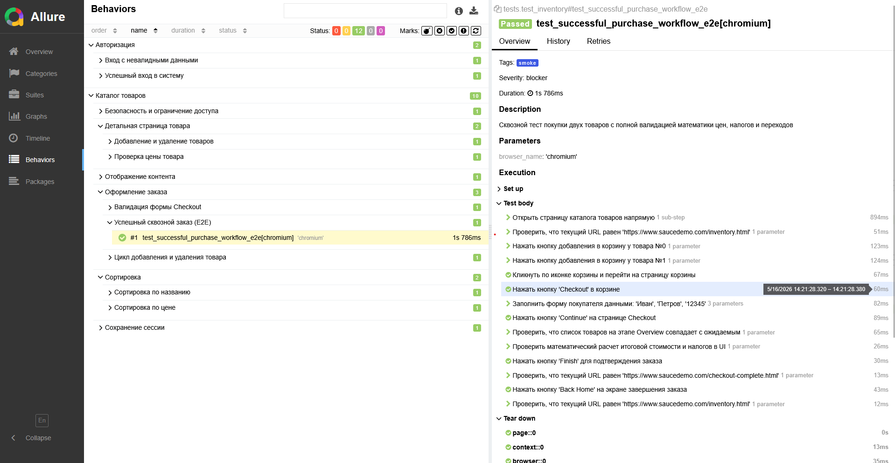

# UI Playwright Test Automation Framework (Saucedemo)


[](https://damian-zaharov.github.io/ui-saucedemo-playwright-test-framework/)

Модульный фреймворк для автоматизации UI-тестирования веб-приложения Saucedemo. Построен на Python, Playwright и Pytest с параллельным запуском и CI/CD.

---

## Стек

* **Язык**: Python 3.10
* **Framework**: Playwright (Sync API)
* **Тест-раннер**: Pytest 8.x
* **Отчетность**: Allure Framework
* **Параллелизация**: pytest-xdist
* **CI/CD**: GitHub Actions + GitHub Pages

---

## Архитектурные особенности

1. **Page Object Model (POM)**: Полное разделение логики страниц (`pages/`) и сценариев тестов (`tests/`). Вся работа с элементами инкапсулирована внутри классов страниц.
2. **Reusing Authentication State (Глобальные куки)**: Фреймворк выполняет авторизацию через UI ровно один раз за сессию. Куки и Local Storage сохраняются в файл `auth_state.json` и автоматически подставляются в контексты последующих тестов.
3. **OS-Level Thread-Safe Auth Locker (`filelock`)**: Логика инициализации сессии полностью адаптирована под многопоточный запуск (`pytest-xdist`). Фреймворк использует межпроцессную блокировку на уровне операционной системы с жестким таймаутом безопасности (`timeout=60`). Если логин не прошёл за 60 сек - остальные тесты выкинут TimeoutError, завершатся false, и не будут тратить бесплатные минуты сборки
4. **Строгая валидация URL**: Проверки адресов страниц используют строгие регулярные выражения (`re.compile`), устойчивые к неявным финальным слэшам `/` и динамическим параметрам.

---

## Структура

```text
ui-saucedemo-playwright-test-framework/
│
├── .github/workflows/
│   └── run_tests.yml        # CI/CD пайплайн для GitHub Actions + Allure Pages
│
├── data/
│   └── credentials.py       # Статические тестовые данные (валидные/невалидные креды)
│
├── pages/
│   ├── base_page.py         # Базовый класс (общие методы, шапка корзины)
│   ├── login_page.py        # Авторизация и валидация ошибок входа
│   ├── inventory_page.py    # Каталог товаров, парсинг карточек, сортировки (A-Z, lo-hi)
│   ├── cart_page.py         # Корзина (проверка контента, удаление товаров)
│   ├── checkout_page.py     # Оформление заказа, шаги ввода данных и Overview
│   └── checkout_complete.py # Финальный экран успешного заказа
│
├── tests/
│   ├── conftest.py          # Жизненный цикл тестов, фикстуры контекстов, хук сортировки запуска
│   ├── test_login.py        # Позитивные и негативные сценарии входа
│   └── test_inventory.py    # E2E сценарии каталога, цен, корзины, сортировок и Checkout
│
├── config.py                # Глобальные конфигурации окружения (URLs, таймауты, BuyerData)
├── pytest.ini               # Конфигурационный файл Pytest (аллюр, браузеры, маркеры)
└── requirements.txt         # Список зафиксированных зависимостей проекта
```

---

## Локальный запуск

### 1. Подготовка окружения
Убедитесь, что у вас установлен Python 3.10. Клонируйте репозиторий и создайте виртуальное окружение:
```bash
git clone <ссылка_на_ваш_репозиторий>
cd ui-saucedemo-playwright-test-framework
python -m venv .venv
source .venv/bin/activate  # Для Linux/macOS
.venv\Scripts\activate     # Для Windows (PowerShell)
```

### 2. Установка зависимостей и браузеров
Установите библиотеки и скачайте бинарники браузера Chromium одной командой:
```bash
pip install -r requirements.txt
playwright install chromium
```

### 3. Запуск тестов
* **Стандартный параллельный запуск:**
  ```bash
  pytest
  ```
* **Запуск с окном браузера:**
  ```bash
  pytest --headed
  ```
* **Запуск одного файла или маркера:**
  ```bash
  pytest tests/test_login.py
  pytest -m smoke
  ```

### 4. Генерация Allure-отчетов локально
Убедитесь, что у вас установлен Allure CLI на компьютере, после чего выполните:
```bash
allure serve allure-results
```

---

## Инфраструктура и CI/CD

Пайплайн в **GitHub Actions** (`run_tests.yml`) настроен на запуск при каждом `push` или `pull_request` в ветку `main`/`master`:
1. Поднимает изолированную среду на базе `ubuntu-22.04` (гарантирует стабильность системных зависимостей `libasound2`).
2. Прогоняет тесты параллельно в **2 потока** (`-n 2`) в фоновом режиме.
3. Собирает сырые JSON результаты, компилирует их в полноценный HTML-отчет Allure.
4. Автоматически деплоит свежий отчет на **GitHub Pages**.


## Allure скриншоты





🔗 **Постоянная ссылка на Allure-отчет**: `https://damian-zaharov.github.io/ui-saucedemo-playwright-test-framework/`

